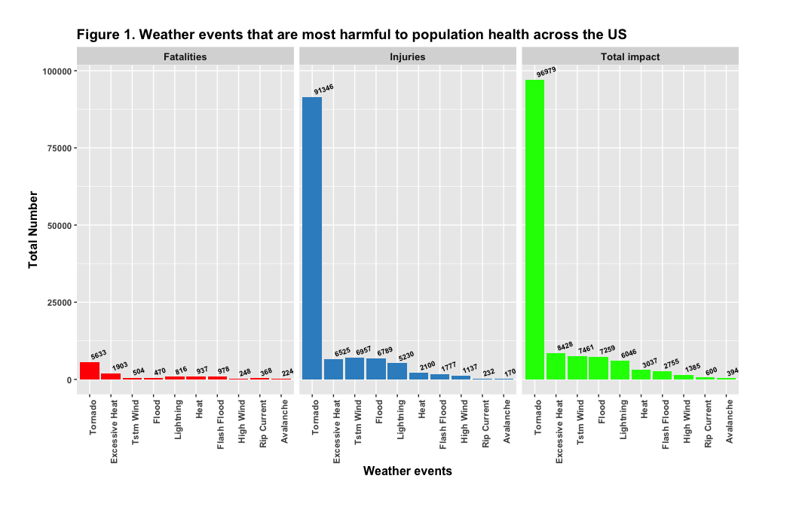
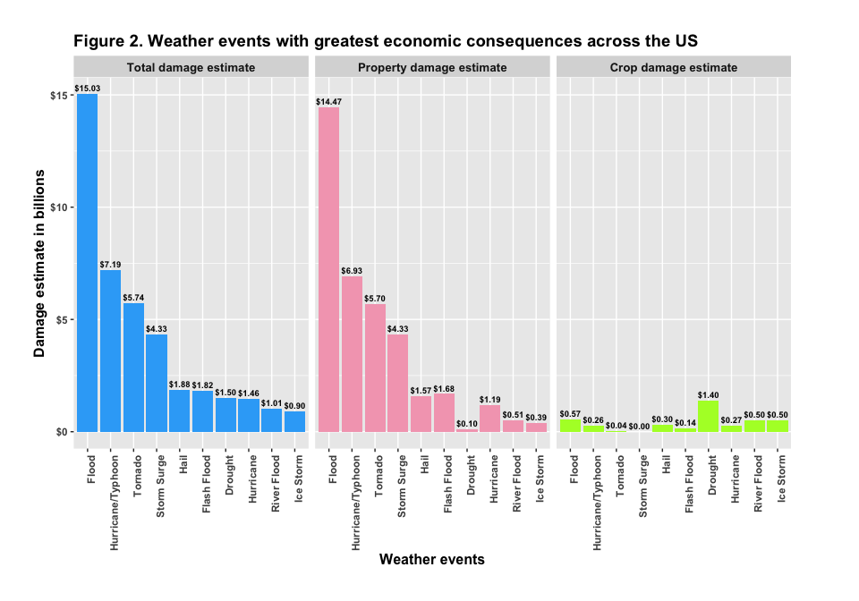

-   [1. Abstract](#abstract)
-   [2. Objectives](#objectives)
-   [3. Materials (Data)](#materials-data)
-   [4. Methods (Data Processing)](#methods-data-processing)
    -   [4.1 Data download](#data-download)
    -   [4.2 Data loading](#data-loading)
    -   [4.3 Data cleaning](#data-cleaning)
-   [5. Results](#results)
    -   [5.1 Weather events that are most harmful to population
        health](#weather-events-that-are-most-harmful-to-population-health)
    -   [5.2 Weather events with greatest economic consequences across
        the
        US](#weather-events-with-greatest-economic-consequences-across-the-us)
-   [6. Conclusions](#conclusions)

## 1. Abstract
-----------

Severe weather phenomena can disrupt public health and can also inflict
damages that have economic consequences. Here, the data from the U.S.
National Oceanic and Atmospheric Administration's Storm Events Database
was analysed to study the impact of severe weather events on population
health and to assess their economic consequences. Of the severe weather
events, tornadoes were identified to have the most harmful impact on
population health in terms of fatalities and injuries. Flood was found
to be the most harmful weather event inflicting property damage and
drought was identified to be the most harmful weather event in
inflicting crop damages. These findings might be helpful to prepare
better and prioritise resources for the future weather events.

## 2. Objectives
-------------

The main goal of this analysis is to explore the U.S. National Oceanic
and Atmospheric Administration's (NOAA) storm database for assessing the
impact of severe weather events. Storm Events Database tracks the
occurrences of severe weather events in the United States and put
together their damage estimates. The current analysis specifically
sought to identify the weather events that are the most harmful with
respect to population health across the Unites States and the weather
events that have the greatest economic consequences across the Unites
States.

## 3. Materials (Data)
-------------------

The data for this analysis is obtained as a compressed
comma-separated-value file from the course web site
(<https://d396qusza40orc.cloudfront.net/repdata%2Fdata%2FStormData.csv.bz2>).
This file was originally collected from the U.S. National Oceanic and
Atmospheric Administration's (NOAA) storm database and comprises data on
the occurrence of storms and other severe weather phenomena from 1950 to
2011. The data of interest for the current analysis in this file
includes the documented number of injuries, number of fatalities,
estimates of crop damage and estimates of property damage associated
with each weather event occurrence across the Unites States.

## 4. Methods (Data Processing)
----------------------------

The data file was downloaded using the provided link and saved with a
modified name to a local folder named `data`. The data file that was
compressed via the bzip2 algorithm, `*csv.bz2`, was directly loaded into
`R` using `read.csv` command. The data was then inspected for its
structure and content using various commands in `R`. Next, the data was
cleaned by modifying the variable names, formatting the variables and
filtering the data frame for analysing the impact of weather effects on
population health and economy and for visualising the results. Of note,
the property and crop damage estimates (variables `cropdmg` and
`propdmg`) documented in the downloaded data were rounded to three
significant digits and their magnitudes were indicated by an
alphabetical character (variables `propdmgexp` and `cropdmgexp`). Hence,
appropriate data transformations were performed on `cropdmg` and
`propdmg` to convert them to the real estimates. The details of the data
processing and provided in the below subsections.

### 4.1 Data download

Data was downloaded using the `download.file` using `curl` as method.

    library(ggplot2)
    library(reshape2)
    library(dplyr)

    ## 
    ## Attaching package: 'dplyr'

    ## The following objects are masked from 'package:stats':
    ## 
    ##     filter, lag

    ## The following objects are masked from 'package:base':
    ## 
    ##     intersect, setdiff, setequal, union

    library(stringr)
    library(DT)
    library(widgetframe)

    ## Loading required package: htmlwidgets

    if (!file.exists("data")) {
      dir.create("data")
    }
    weather_url <- "https://d396qusza40orc.cloudfront.net/repdata%2Fdata%2FStormData.csv.bz2"

    if (!file.exists("./data/repdata_StormData.csv.bz2")) {
      download.file(
        weather_url,
        destfile = "./data/repdata_StormData.csv.bz2",
        method = "curl"
      )
    }

### 4.2 Data loading

Loading data into `R` and inspecting the variables and their formats.

    weather_dat <- read.csv("./data/repdata_StormData.csv.bz2")

    # checking the weather_dat data frame
    class(weather_dat)

    ## [1] "data.frame"

    dim(weather_dat)

    ## [1] 902297     37

    str(weather_dat)

    ## 'data.frame':    902297 obs. of  37 variables:
    ##  $ STATE__   : num  1 1 1 1 1 1 1 1 1 1 ...
    ##  $ BGN_DATE  : Factor w/ 16335 levels "1/1/1966 0:00:00",..: 6523 6523 4242 11116 2224 2224 2260 383 3980 3980 ...
    ##  $ BGN_TIME  : Factor w/ 3608 levels "00:00:00 AM",..: 272 287 2705 1683 2584 3186 242 1683 3186 3186 ...
    ##  $ TIME_ZONE : Factor w/ 22 levels "ADT","AKS","AST",..: 7 7 7 7 7 7 7 7 7 7 ...
    ##  $ COUNTY    : num  97 3 57 89 43 77 9 123 125 57 ...
    ##  $ COUNTYNAME: Factor w/ 29601 levels "","5NM E OF MACKINAC BRIDGE TO PRESQUE ISLE LT MI",..: 13513 1873 4598 10592 4372 10094 1973 23873 24418 4598 ...
    ##  $ STATE     : Factor w/ 72 levels "AK","AL","AM",..: 2 2 2 2 2 2 2 2 2 2 ...
    ##  $ EVTYPE    : Factor w/ 985 levels "   HIGH SURF ADVISORY",..: 834 834 834 834 834 834 834 834 834 834 ...
    ##  $ BGN_RANGE : num  0 0 0 0 0 0 0 0 0 0 ...
    ##  $ BGN_AZI   : Factor w/ 35 levels "","  N"," NW",..: 1 1 1 1 1 1 1 1 1 1 ...
    ##  $ BGN_LOCATI: Factor w/ 54429 levels ""," Christiansburg",..: 1 1 1 1 1 1 1 1 1 1 ...
    ##  $ END_DATE  : Factor w/ 6663 levels "","1/1/1993 0:00:00",..: 1 1 1 1 1 1 1 1 1 1 ...
    ##  $ END_TIME  : Factor w/ 3647 levels ""," 0900CST",..: 1 1 1 1 1 1 1 1 1 1 ...
    ##  $ COUNTY_END: num  0 0 0 0 0 0 0 0 0 0 ...
    ##  $ COUNTYENDN: logi  NA NA NA NA NA NA ...
    ##  $ END_RANGE : num  0 0 0 0 0 0 0 0 0 0 ...
    ##  $ END_AZI   : Factor w/ 24 levels "","E","ENE","ESE",..: 1 1 1 1 1 1 1 1 1 1 ...
    ##  $ END_LOCATI: Factor w/ 34506 levels ""," CANTON"," TULIA",..: 1 1 1 1 1 1 1 1 1 1 ...
    ##  $ LENGTH    : num  14 2 0.1 0 0 1.5 1.5 0 3.3 2.3 ...
    ##  $ WIDTH     : num  100 150 123 100 150 177 33 33 100 100 ...
    ##  $ F         : int  3 2 2 2 2 2 2 1 3 3 ...
    ##  $ MAG       : num  0 0 0 0 0 0 0 0 0 0 ...
    ##  $ FATALITIES: num  0 0 0 0 0 0 0 0 1 0 ...
    ##  $ INJURIES  : num  15 0 2 2 2 6 1 0 14 0 ...
    ##  $ PROPDMG   : num  25 2.5 25 2.5 2.5 2.5 2.5 2.5 25 25 ...
    ##  $ PROPDMGEXP: Factor w/ 19 levels "","-","?","+",..: 17 17 17 17 17 17 17 17 17 17 ...
    ##  $ CROPDMG   : num  0 0 0 0 0 0 0 0 0 0 ...
    ##  $ CROPDMGEXP: Factor w/ 9 levels "","?","0","2",..: 1 1 1 1 1 1 1 1 1 1 ...
    ##  $ WFO       : Factor w/ 542 levels ""," CI","%SD",..: 1 1 1 1 1 1 1 1 1 1 ...
    ##  $ STATEOFFIC: Factor w/ 250 levels "","ALABAMA, Central",..: 1 1 1 1 1 1 1 1 1 1 ...
    ##  $ ZONENAMES : Factor w/ 25112 levels "","                                                                                                               "| __truncated__,..: 1 1 1 1 1 1 1 1 1 1 ...
    ##  $ LATITUDE  : num  3040 3042 3340 3458 3412 ...
    ##  $ LONGITUDE : num  8812 8755 8742 8626 8642 ...
    ##  $ LATITUDE_E: num  3051 0 0 0 0 ...
    ##  $ LONGITUDE_: num  8806 0 0 0 0 ...
    ##  $ REMARKS   : Factor w/ 436781 levels "","\t","\t\t",..: 1 1 1 1 1 1 1 1 1 1 ...
    ##  $ REFNUM    : num  1 2 3 4 5 6 7 8 9 10 ...

### 4.3 Data cleaning

All the variable names were then formatted to lower case and the weather
event types indicated by the variable `evtype` were formatted in such a
way that all the characters of the variable `evtype`, except the first,
were converted to lower case.

    #changing column names to lower case
    colnames(weather_dat) <- tolower(colnames(weather_dat))

    # formatting the weather event types
    weather_dat <- mutate(
      weather_dat,
      evtype = str_to_title(evtype)
    )

#### 4.3.1 Data filtering and formatting

As the study aims to investigate the events that are most harmful with
respect to population health and those that have the greatest economic
consequences, only the variables needed for assessing these objectives
were selected from the dataset for further analysis. The variables from
the storms database data that are needed for this analysis and their
details are given in the Table 1.

Next, the variable `propdmgexp` which indicate the magnitude of property
damage estimate is converted to upper case. The actual property damage
estimates are calculated by multiplying the rounded property damage
estimate `propdmg` and the new variable with the numerical magnitude of
the property damage, `propdmgexpnum`, and is then stored to a new
variable `propdmgestimate`. Similarly, the variable `cropdmgexp`, the
magnitude of crop damage estimate, is converted to upper case. The
actual crop damage estimates are calculated by multiplying the rounded
crop damage estimate `cropdmg` and the new variable indicating numerical
magnitude of the crop damage, `cropdmgexpnum`, which is then assigned to
a new variable `cropdmgestimate`. In addition to the alphabetical
characters that indicate the magnitude of damage estimate as mentioned
in the storm data documentation, some other characters \[-?+\] and
numbers \[0-9\] were also used in the variables `cropdmgexp` and
`propdmgexp` as magnitude indicators. These were also converted to
corresponding numerical magnitudes for calculating the actual damage
estimates. The codes for these processing steps are given below with
comments.

    #
    ##############################################################################
    #
    #   listing the variables needed for performing the analysis
    #
    ##############################################################################

    variables_analysed <- data.frame(
      "variable" =
        c(
          "evtype",
          "fatalities",
          "injuries",
          "propdmg",
          "propdmgexp",
          "cropdmg",
          "cropdmgexp"
        ),
      "info" = c(
        "Factor variable indicating weather events",
        "Number of fatalities incurred in the weather event",
        "Number of injuries incurred in the weather event",
        "Rounded estimate of the property damage",
        "Characters (alphabets, numbers and others) that indicate magnitude of the property damage",
        "Rounded estimate of the crop damage",
        "Characters (alphabets, numbers and others) that indicate magnitude of the crop damage"
      )
    )

    # making a table of the variables and their information that will be used in the analysis
    table1 <- datatable(variables_analysed,
      colnames = c(
        "Variable Name",
        "Variable Information"
      ),
      caption = "Table 1: Variables of interest for the analysis"
    )
    frameWidget(table1, height = 350, width = '90%')

<!--html_preserve-->

<!--/html_preserve-->
   

    ##############################################################################
    #
    #   creating a new dataset with only the needed variables for the analysis
    #
    ##############################################################################

    weather_dat <- weather_dat %>%
      select(c(
        "evtype",
        "fatalities",
        "injuries",
        "propdmg",
        "propdmgexp",
        "cropdmg",
        "cropdmgexp"
      ))

    # checking the new data frame
    dim(weather_dat)

    ## [1] 902297      7

    colnames(weather_dat)

    ## [1] "evtype"     "fatalities" "injuries"   "propdmg"    "propdmgexp"
    ## [6] "cropdmg"    "cropdmgexp"

    sapply(weather_dat, class)

    ##      evtype  fatalities    injuries     propdmg  propdmgexp     cropdmg 
    ## "character"   "numeric"   "numeric"   "numeric"    "factor"   "numeric" 
    ##  cropdmgexp 
    ##    "factor"

    # checking the cropdmgexp
    table(weather_dat$cropdmgexp)

    ## 
    ##             ?      0      2      B      k      K      m      M 
    ## 618413      7     19      1      9     21 281832      1   1994

    ####################################################################
    #
    #     formatting and transforming variables
    #
    ####################################################################

    weather_dat <- weather_dat %>%
      mutate(propdmgexp = toupper(propdmgexp), cropdmgexp = toupper(cropdmgexp)) %>%
      mutate(propdmgexpnum = case_when(
        propdmgexp == "H" ~ 10^2,
        propdmgexp == "K" ~ 10^3,
        propdmgexp == "M" ~ 10^6,
        propdmgexp == "B" ~ 10^9,
        propdmgexp == "1" ~ 10^1,
        propdmgexp == "2" ~ 10^2,
        propdmgexp == "3" ~ 10^3,
        propdmgexp == "4" ~ 10^4,
        propdmgexp == "5" ~ 10^5,
        propdmgexp == "6" ~ 10^6,
        propdmgexp == "7" ~ 10^7,
        propdmgexp == "8" ~ 10^8,
        propdmgexp == "0" ~ 10^0,
        propdmgexp == "-" ~ 10^0,
        propdmgexp == "+" ~ 10^0,
        propdmgexp == "?" ~ 10^0,
        propdmgexp == "" ~ 10^0
      )) %>%
      mutate(propdmgestimate = propdmg * propdmgexpnum) %>%
      mutate(cropdmgexpnum = case_when(
        cropdmgexp == "K" ~ 10^3,
        cropdmgexp == "M" ~ 10^6,
        cropdmgexp == "B" ~ 10^9,
        cropdmgexp == "2" ~ 10^2,
        cropdmgexp == "0" ~ 10^0,
        cropdmgexp == "?" ~ 10^0,
        cropdmgexp == "" ~ 10^0
      )) %>%
      mutate(cropdmgestimate = cropdmg * cropdmgexpnum) %>%
      mutate(totaldmgestimate = propdmgestimate + cropdmgestimate)

    # checking the weather_dat again
    sapply(weather_dat, class)

    ##           evtype       fatalities         injuries          propdmg 
    ##      "character"        "numeric"        "numeric"        "numeric" 
    ##       propdmgexp          cropdmg       cropdmgexp    propdmgexpnum 
    ##      "character"        "numeric"      "character"        "numeric" 
    ##  propdmgestimate    cropdmgexpnum  cropdmgestimate totaldmgestimate 
    ##        "numeric"        "numeric"        "numeric"        "numeric"

    data.frame(table(weather_dat$propdmgexp))

    ##    Var1   Freq
    ## 1       465934
    ## 2     -      1
    ## 3     ?      8
    ## 4     +      5
    ## 5     0    216
    ## 6     1     25
    ## 7     2     13
    ## 8     3      4
    ## 9     4      4
    ## 10    5     28
    ## 11    6      4
    ## 12    7      5
    ## 13    8      1
    ## 14    B     40
    ## 15    H      7
    ## 16    K 424665
    ## 17    M  11337

    data.frame(table(weather_dat$propdmgexpnum))

    ##     Var1   Freq
    ## 1      1 466164
    ## 2     10     25
    ## 3    100     20
    ## 4   1000 424669
    ## 5  10000      4
    ## 6  1e+05     28
    ## 7  1e+06  11341
    ## 8  1e+07      5
    ## 9  1e+08      1
    ## 10 1e+09     40

    data.frame(table(weather_dat$cropdmgexp))

    ##   Var1   Freq
    ## 1      618413
    ## 2    ?      7
    ## 3    0     19
    ## 4    2      1
    ## 5    B      9
    ## 6    K 281853
    ## 7    M   1995

    data.frame(table(weather_dat$cropdmgexpnum))

    ##    Var1   Freq
    ## 1     1 618439
    ## 2   100      1
    ## 3  1000 281853
    ## 4 1e+06   1995
    ## 5 1e+09      9

## 5. Results
----------

### 5.1 Weather events that are most harmful to population health

The impact of each type of weather event on population health was
assessed by summing up the number of fatalities and injuries that were
documented for them.

    ####################################################################
    #
    # summarise storm data both by total fatalities and total injuries
    #
    ####################################################################
    weather_fatalities_injuries <- weather_dat %>%
      group_by(evtype) %>%
      summarise(
        total_fatalities = sum(fatalities),
        total_injuries = sum(injuries),
        total_impact = sum(fatalities, injuries)
      ) %>%
      filter(total_impact > 0) %>%
      arrange(desc(total_fatalities), desc(total_injuries))

#### Formatting the data frame for plotting weather related fatalities and injuries

Here, the 10 most harmful weather events affecting population health
were chosen for visualisation and 75 most harmful weather events
affecting population health were displayed in Table 2.

    #########################################################################################
    #
    # getting the 10 most harmful events and formatting (melting the data frame for plotting)
    #
    #########################################################################################
    weather_fatalities_injuries_melted <- weather_fatalities_injuries %>%
      slice(1:10) %>%
      melt(
        id = c("evtype"),
        variable.name = "harmful_events",
        value.name = "total"
      )

    # creating labels for facets
    facet_labels_plot1 <- c(
      total_fatalities = "Fatalities",
      total_injuries = "Injuries",
      total_impact = "Total impact"
    )

    ####################################################################################
    #
    #     plot showing the 10 most severe weather events affecting population health
    #
    ####################################################################################
    ggplot(
      weather_fatalities_injuries_melted,
      aes(
        x = reorder(evtype, -total),
        y = total,
        fill = harmful_events,
        label = total
      )
    ) +
      geom_bar(stat = "identity", position = position_dodge()) +
      labs(
        title = "Figure 1. Weather events that are most harmful to population health across the US",
        x = "Weather events", 
        y = "Total Number",
        fill = "Harmful events"
      ) +
      facet_grid(. ~ harmful_events,
        labeller = labeller(harmful_events = facet_labels_plot1)
      ) +
      scale_fill_manual(values = c("red", "#368FC8", "green")) +
      theme(
        plot.margin = margin(1, 2, 1, 1, "cm"),
        plot.title = element_text(size = 14, face = "bold"),
        axis.text.x = element_text(angle = 90, hjust = 1, face = "bold"),
        axis.text.y = element_text(face = "bold"),
        axis.title.y = element_text(size = 12, face = "bold"),
        axis.title.x = element_text(size = 12, face = "bold"),
        strip.text.x = element_text(size = 10, face = "bold")
      ) +
      geom_text(
        aes(group = harmful_events),
        hjust = -0.2,
        vjust = -0.3,
        size = 2.5,
        fontface = "bold",
        angle = 20
      ) +
      guides(fill = FALSE)

   

    ##########################################################################################################
    #
    #     table with 75 most severe weather events which had the greatest impact on the population health
    #
    ##########################################################################################################

    table2 <- weather_fatalities_injuries %>%
      slice(1:75) %>%
      datatable(
        colnames = c(
          "Weather events",
          "Number of fatalities",
          "Number of injuries",
          "Total impact"
        ),
        caption = "Table 2. Weather events affecting population health across US from 1950-2011"
      )
    frameWidget(table2, height = 350, width = '90%')

<!--html_preserve-->

<!--/html_preserve-->
   

### 5.2 Weather events with greatest economic consequences across the US

As per the Storms database, property damage covers the damage inflicted
to private property as well as public infrastructure. In this analysis,
recorded estimates of both the property damages and crop damages were
used to evaluate the economic consequences of each of different types of
weather events. A plot showing the 10 most severe weather events with
greatest economic consequences across the United States is provided in
Figure 2. In Figure 2, the damage estimates are formatted in billions
(US dollars). The actual damage estimates for the top 150 weather events
have been provided as US dollars in Table 3.

    ################################################################################################
    #
    # summarise storm data by total damage estimate, total property damage and total crop damage
    #
    #################################################################################################

    weather_damage_overall <- weather_dat %>%
      group_by(evtype) %>%
      summarise(
        evt_wise_total_dmg = sum(totaldmgestimate),
        evt_wise_prop_dmg = sum(propdmgestimate),
        evt_wise_crop_dmg = sum(cropdmgestimate)
      ) %>%
      filter(evt_wise_total_dmg > 0) %>%
      arrange(
        desc(evt_wise_total_dmg),
        desc(evt_wise_prop_dmg),
        desc(evt_wise_crop_dmg)
      ) %>%
      slice(1:150)

   

    ##########################################################################
    #
    #     formatting the weather_damage_overall for plotting
    #
    ##########################################################################
    # formatting numbers and selecting the top 10 harmful weather events
    weather_damage_overall_top10 <- weather_damage_overall %>%
      mutate(
        evt_wise_total_dmg = round(evt_wise_total_dmg / 10e9, digits = 3),
        evt_wise_prop_dmg = round(evt_wise_prop_dmg / 10e9, digits = 3),
        evt_wise_crop_dmg = round(evt_wise_crop_dmg / 10e9, digits = 3)
      ) %>%
      slice(1:10)

    # formatting the data frame
    weather_damage_overall_melted <- melt(
      weather_damage_overall_top10,
      id = c("evtype"),
      variable.name = "economic_consequence",
      value.name = "total"
    )

    # creating labels for the plot facets
    facet_labels <- c(
      evt_wise_total_dmg = "Total damage estimate",
      evt_wise_prop_dmg = "Property damage estimate",
      evt_wise_crop_dmg = "Crop damage estimate"
    )

    ##########################################################################
    #
    #     plot showing weather events having greatest impact on the economy
    #
    ##########################################################################
    ggplot(
      weather_damage_overall_melted,
      aes(
        x = reorder(evtype, -total),
        y = total, fill = economic_consequence,
        label = round(total, digits = 2)
      )
    ) +
      geom_bar(stat = "identity", position = position_dodge()) +
      labs(
        title = "Figure 2. Weather events with greatest economic consequences across the US",
        x = "Weather events", y = "Damage estimate in billions",
        fill = "Economic consequence"
      ) +
      facet_grid(. ~ economic_consequence,
        labeller = labeller(economic_consequence = facet_labels)
      ) +
      theme(
        plot.margin = margin(1, 2, 1, 1, "cm"),
        plot.title = element_text(size = 14, face = "bold"),
        axis.text.x = element_text(angle = 90, hjust = 1, face = "bold"),
        axis.text.y = element_text(face = "bold"),
        axis.title.y = element_text(size = 12, face = "bold"),
        axis.title.x = element_text(size = 12, face = "bold"),
        strip.text.x = element_text(size = 10, face = "bold")
      ) +
      scale_fill_manual(
        values = c("#34ABF7", "#F4A7BD", "greenyellow")
      ) +
      scale_y_continuous(labels = scales::dollar) +
      geom_text(
        aes(label = scales::dollar(total)),
        vjust = -0.5,
        size = 2.5,
        fontface = "bold"
      ) +
      guides(fill = FALSE)

   

#### Economic consequences of weather related events across US

Severe weather events (top 150) having the greatest economic
consequences across the United States based on data from 1950-2011 are
given in Table 3 below.    

    #################################################################################################
    #
    #     table with top 150 weather events which had the greatest impact on the US economy
    #
    ##################################################################################################
    table3 <- datatable(weather_damage_overall,
      colnames = c(
        "Weather event",
        "Total damage estimate",
        "Property damage estimate",
        "Crop damage estimate"
      ),
      caption = "Table 3. Economic consequences of weather related events across US from 1950-2011"
    ) %>%
      formatCurrency(c(
        "evt_wise_total_dmg",
        "evt_wise_prop_dmg",
        "evt_wise_crop_dmg"
      ))
    frameWidget(table3, height = 350, width = '90%')

<!--html_preserve-->

<!--/html_preserve-->
## 6. Conclusions
--------------

Based on the exploratory analyses of the data from the Storms database,
tornadoes were identified to have the greatest impact on the population
health in terms of the number of fatalities and injuries. Excessive head
and flash flood were found to be the second and third most harmful
weather events that affected the population health with respect to the
number of fatalities. Whereas, thunderstorm wind and flood were
identified as the second and third most harmful weather events that
affected the population health with respect to the number of injuries.
Flood, hurricane/typhoon and tornado were found to be the three most
harmful weather events that inflict damages to the property across the
United States. Drought, flood and river flood were identified as the
three most severe weather events having the greatest economic
consequences across the United States in terms of crop damage. Taken
together, these results provide insights on the weather events that are
most harmful in terms of population health and economic consequence.
These findings might be helpful to prepare better for future weather
events and to reduce the harmful outcomes.
